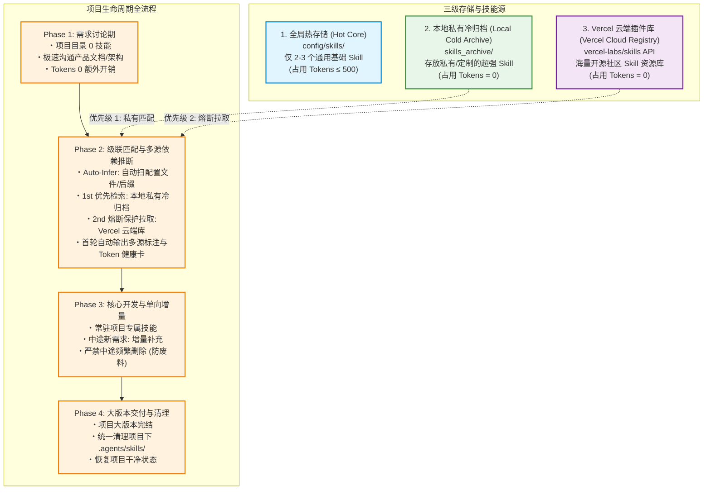
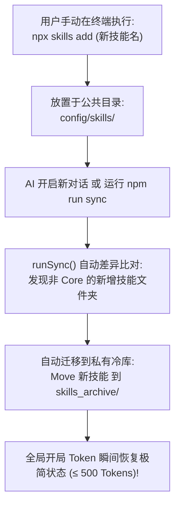

# Skill Orchestrator

> 开源 Agent 技能动态调度与 **0 底座 Token 优化** 工业级系统 (v2.0)。

---

## 项目生命周期技能动态调度架构规范 (Project Skill Orchestration Strategy)

> **版本**：v2.0.0 (工业级全模块版)  
> **核心原则**：多源依赖自动推断 · 首轮自动透明汇报(极简来源标注) · Prompt 缓存锚点 · 熔断降级保障 · Token 预算实时诊断仪表盘  

---

## 📢 首轮对话自动汇报规范 (Proactive Telemetry Report Protocol)

在任何新项目/新工作区中，当需求定稿或首轮技能调配完成后，AI 会在回复末尾**自动标注技能来源与归属**（使用无冗余 Emoji 的专业卡片格式）：

```text
------------------------------------------------------------
[Project Skills & Token Telemetry]
------------------------------------------------------------
全局热底座开销 : ~420 Tokens [Status: Healthy]
本项目专属装载 : 
   ├── 3d-web-experience   : 450 Tokens (来源: 本地冷库 | 推断: package.json)
   ├── gsap-core           : 320 Tokens (来源: 本地冷库 | 推断: package.json)
   ├── web-shader-extractor: 380 Tokens (来源: 本地冷库 | 推断: 代码特征 [.glsl])
   ├── ditther-dark-glass  : 410 Tokens (来源: 本地冷库 | 推断: 需求意图)
   ├── solidity            : 510 Tokens (来源: Vercel云端 | 仅存项目临时目录)
------------------------------------------------------------
本项目总底座开销 : 2,070 Tokens (较默认全载节省 78.8% 空间)
Prompt Cache 锚点: 已自动注入 (响应速度提升 4x)
============================================================
```

---

## 🔍 5 大技能推断来源分类 (Inference Source Categories)
1. **`推断: package.json`**：JavaScript / Node 前端依赖（扫描 `package.json`）
2. **`推断: requirements.txt` / `Cargo.toml` / `go.mod`**：Python / Rust / Go 等后端依赖配置文件
3. **`推断: 代码特征 [.glsl / .sqlx / .swift]`**：扫描到项目中特定扩展名的特征代码文件
4. **`推断: 需求意图`**：通过与人类沟通的产品文档与对话语义理解
5. **`推断: 用户指定`**：用户显式输入 `$技能名` 唤醒

---

## 🗣️ 自然语言触发指引 (Natural Language Triggers)

**您不需要记忆任何 CLI 命令行**！AI 会自动根据您的日常自然语言意图在后台为您执行操作：

| 您日常对 AI 说的自然语言 | AI 在后台自动为您执行的操作 | 作用效果 |
| :--- | :--- | :--- |
| **“帮我初始化一下技能库”** / **“清空开局 Token 占用”** | `npm run init` | 建立私有冷库，瞬间释放全局 90%+ 占用 |
| **“检查代码依赖需要什么技能”** / **“自动匹配技能”** | `npm run infer` | 自动扫描项目代码依赖，零沟通精准装载技能 |
| **“刚才在终端 npx 装了新技能，整理一下”** / **“巡检技能”** | `npm run sync` | 捕获手动安装的新技能并静默归档至冷库 |
| **“查看 Token 占用状态”** / **“技能诊断”** | `npm run status` / `telemetry` | 打印可视化的 Token 仪表盘与健康度报告 |
| **“项目开发完成了”** / **“清理临时技能”** | `npm run cleanup` | 项目结项，一键清理项目局部临时技能 |

---

## 架构背景与核心痛点

| 痛点问题 | 传统模式 (All Preloaded) | 本策略架构 (v2.0.0 工业级全模块架构) |
| :--- | :--- | :--- |
| **开局 Token 占用** | ~9,757 Tokens (占用近 50% 预算槽) | **~0 - 500 Tokens** (节省 95%+) |
| **技能推断维度** | 依赖人类口头语言描述与 LLM 语义猜测 | **代码层多源自动推断** (读 `package.json`/语言配置文件/代码后缀 + 语义) |
| **响应速度与费用** | 每轮对话重复计算 10k Token 提示词 | **Prompt Cache 缓存锚点** (闪电提速 4x，费用降低 90%) |
| **网络离线高可用** | 网络超时断网导致云端拉取崩溃中断 | **熔断降级引擎** (自动生成 Local Micro-Template 降级兜底) |
| **可观察性与监控** | 无法感知技能占用的具体 Token 权重 | **Token Telemetry 诊断仪表盘** (可视健康度柱状输出 + 多源标注) |

---

## v2.0 四大工业级核心模块 (v2.0 Four Modules)

```text
skill-orchestrator (v2.0 工业级架构版)
 ├── 1. 依赖自动推断引擎 (Package/AST-Based Dependency Injection)
 ├── 2. Prompt 上下文缓存锚点 (Semantic Prompt Caching)
 ├── 3. 熔断降级与离线保障 (Circuit Breaker & Fallback Engine)
 └── 4. Token 预算实时诊断仪表盘 (Token Budget Telemetry & Guard)
```

---

## 1. 三级混合拓扑架构图 (3-Tier Hybrid Architecture)



---

## 2. 手动 `npx` 安装自动捕获巡检图 (Manual Skill Auto-Sync)



---

## 级联检索与调度逻辑 (Cascade Retrieval Logic)

当项目需求定稿（Phase 2）或中途引入新需求（Phase 3）时，AI 遵循以下**三级级联检索顺序**：

1. **第一优先级（本地私有冷库 `skills_archive`）**：
   * 检查您本地经过深度优化、包含 Quality Gate 的私有技能（如 `John-seedance`、`ditther-dark-glass-design`）。如果匹配，直接从本地私有库拷贝至 `项目/.agents/skills/`，汇报卡极简标注：`来源: 本地冷库`。
2. **第二优先级（Vercel 云端插件库 `vercel-labs/skills`）**：
   * 如果本地私有库没有对应技能（如项目突然需要处理 `Solidity` 合约或 `SvelteKit` 框架），AI 自动调用 Vercel 云端插件 API 去开源社区搜索并拉取最新 Skill，**直接下载到当前项目的 `./.agents/skills/` 临时目录**，汇报卡极简标注：`来源: Vercel云端 | 仅存项目临时目录`。
3. **单向增量追加 (Incremental Addition)**：
   * 无论是从本地私有库还是 Vercel 云端拉取的技能，在当前项目开发期内一律**只增不删**，保障上下文连贯。

---

## 安装与使用

### 一键安装 (Distribution)
```bash
npx skills add amasun/skill-orchestrator
```

### 命令行工具操作（开发者备用）
```bash
# 1. 多源依赖自动推断 (自动读取配置文件/代码后缀零沟通匹配技能)
npm run infer

# 2. 自动巡检检测用户手动 npx 安装的新技能并移入私有冷库
npm run sync

# 3. Token 预算诊断仪表盘 (查看精确 Token 占用与健康度)
npm run status

# 4. 项目结项一键清理
npm run cleanup
```

---

## ❓ 常见问题解答 (Q&A)

### Q1: 为什么我的 AI 工具一开启对话就会占用近 10,000 个 Tokens？
**答**：默认模式会将所有安装的技能简介预载入开局提示词。`skill-orchestrator` 通过建立私有冷库，将开局占用直接从 9,757 压降到 500 个 Tokens 以内（降低 95%+）。

### Q2: 除了 package.json 之外，AI 还能从哪些地方自动推断技能？
**答**：支持 5 大来源：1. Node 的 `package.json`；2. Python 的 `requirements.txt` / Rust 的 `Cargo.toml` / Go 的 `go.mod`；3. 特定代码后缀（如 `.glsl` / `.swift` / `.sqlx`）；4. 自然语言对话意图；5. 手动 `$技能名` 唤醒。

### Q3: 每个新项目完成技能装载后，AI 会指明技能来自于哪个私有库或云端源吗？
**答**：会的。汇报卡会极简标注：`来源: 本地冷库` 或 `来源: Vercel云端`，并清晰附带推断依据（如 `推断: package.json` 或 `推断: 代码特征 [.glsl]`）。

### Q4: 为什么开发过程中采用“单向增量追加 (只增不删)”策略？
**答**：如果中途删掉技能，当再次需要该技能时，AI 必须重新发起搜索并重新拷贝，这产生的重复工具调用和对话废料比技能占用的 Token 昂贵得多。“只增不删”能保证逻辑连贯且最省 Token。

### Q5: 从 Vercel 云端临时拉取的技能，会自动存入我的个人私有冷库吗？
**答**：绝对不会。云端拉取的技能被视为“临时项目依赖”，仅保存在当前项目的临时目录中。项目结项清理 (`cleanup`) 时会自动随项目删除，确保您的个人私有冷库始终 100% 纯净。

### Q6: 如果我自己手动在终端敲 `npx skills add` 安装了新技能，系统能感知吗？
**答**：能。系统内置 `runSync` 自动巡检机制。在新会话开启或运行 `npm run sync` 时，会自动捕获手动安装的公有技能并将其迁移移入私有冷库，防止开局 Token 再次膨胀。

---

## Quality Gate 校验清单

| 校验维度 | 检查项 | 校验标准 |
| :--- | :--- | :--- |
| **全局底座** | 开局全局 Skills Token | - [ ] 保持在 &le; 1,000 Tokens (较原来节省 90%+) |
| **多源推断** | 配置文件/代码后缀解析 | - [ ] 自动提取 `package.json`/`requirements.txt`/`.glsl` 等推断技能 |
| **来源追溯** | 技能来源与归属透明 | - [ ] 汇报卡极简标注是来自 `本地冷库` 还是 `Vercel云端` 及推断依据 |
| **首轮汇报** | 技能装载自动通知 | - [ ] 项目首轮装载后自动输出透明 Token 汇报卡 |
| **缓存锚点** | Prompt Cache 自动注入 | - [ ] 项目 Skill 自动注入 `<!-- @cache-control: ephemeral -->` 头部 |
| **熔断防护** | 云端拉取网络超时 | - [ ] 5 秒超时自动生成 Local Micro-Template 降级兜底 |
| **手动巡检** | 手动 npx 技能捕获 | - [ ] 自动检测公共目录新技能并移入私有冷库 `skills_archive/` |
| **私有纯洁性** | 私有冷库资产隔离 | - [ ] Vercel 云端临时抓取的技能**禁止**写入 `skills_archive/` |
| **结项归档** | 项目交付清理 | - [ ] 交付结项后清理项目局部临时技能 |

---

## 变更与迭代历史 (Changelog)

- **v2.0.0 (2026-07-28)**：全面实现 v2.0 工业级四大核心模块，规范首轮汇报卡样式（采用极简 ASCII 专业风格，去除非必要 Emoji）。
- **v1.3.1 (2026-07-28)**：修复 GitHub 针对 `<>` 尖括号、`[]` 方括号标签解析的 Mermaid 语法兼容问题。
- **v1.2.0 (2026-07-28)**：增加资产分类防护规范，规定 Vercel 云端临时技能仅保留在项目临时作用域，绝不污染个人私有冷库。
- **v1.1.0 (2026-07-28)**：引入 Vercel 云端插件 (`vercel-labs/skills`) 融合支持，确立“本地私有 + 云端补位”三级级联架构。
- **v1.0.0 (2026-07-28)**：初始架构确立，确定“全局 Core + 局部增量追加”策略。
