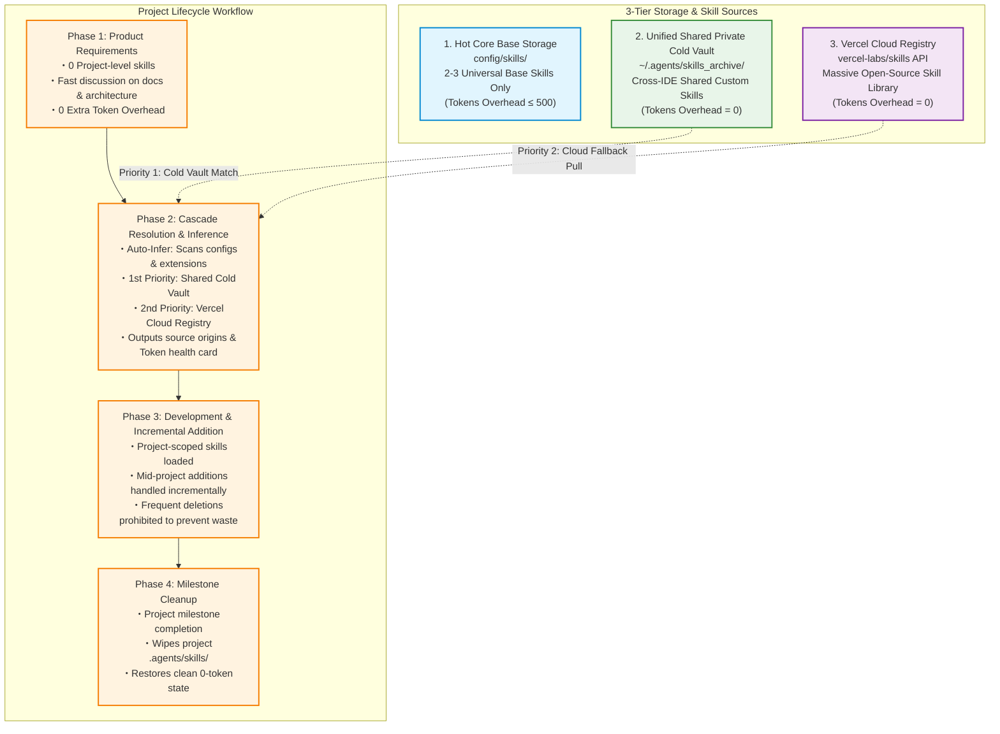
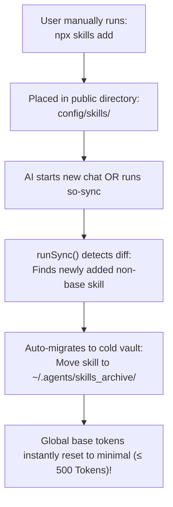

# Skill Orchestrator (v3.8.0)

> Dynamic Project Skill Orchestrator & 0 Base Token Budget Management Engine for AI Coding Agents.

[English](README.md) | [简体中文](README_CN.md)

---

## 🔥 Pain Points & Core Capabilities

In traditional setups, all AI Agent Skills are preloaded upfront into every conversation, leading to massive context waste and fragmented private assets. `skill-orchestrator` resolves this by maintaining a unified shared cold archive vault and code-level dynamic skill inference:

| Pain Point | Traditional Mode (All Preloaded) | Skill Orchestrator (v3.8.0 Architecture) | Key Capability |
| :--- | :--- | :--- | :--- |
| **Base Token Overhead** | ~9,757 Tokens (Uses ~50% context budget) | **~0 - 500 Tokens** (Reduced by 95%+) | **0 Base Token Release**: Minimal hot base isolated from private cold vault |
| **Twin Human-Machine Panel** | Scattered config files hard to inspect visually | **`so_skills_registry` Twin Files** | **Twin Control System**: Markdown human UI panel & JSON machine engine |
| **Private Skill Fragmentation**| Isolated & duplicated across agent/IDE folders | **Unified Shared Cold Vault** (`~/.agents/skills_archive/`) | **Unified Cross-IDE Assets**: 0ms shared across Antigravity/Trae/Claude |
| **Skill Lifecycle & Scope** | Global pollution, chaotic project loading | **Priority-Based Dynamic Loading** (Project > Cold Vault > Cloud) | **Project-Local Encapsulation**: Skills cleanly scoped in `./.agents/skills/` |
| **Skill Inference Dimensions**| Relies on verbal user description & LLM guesses | **5-Dimension Code Inference** (Scans `package.json`/extensions/intent) | **Zero-Friction Inference**: Auto-scans config files & `.glsl`/`.swift` extensions |
| **Short Aliases & Directives** | Relies on memorizing long CLI commands | **`so` and `so-xxx` Quick Directives** | **Frictionless Control**: `so-status`, `so-infer`, `so-sync`, `so-cleanup` |

---

## ⚡ Shortcuts & Natural Language Triggers

In the AI chat box, use **quick alias directives**, **slash commands**, or **natural language statements** directly to trigger backend operations:

| Quick Directive / Alias (Recommended) | Slash Syntax | Natural Language Statement | Target Backend Execution |
| :--- | :---: | :--- | :--- |
| **`so-status`** | `/so-status` / `so status` | **"Check token overhead", "Skill diagnostics", "View control panel"** | `npx skill-orchestrator status` |
| **`so-infer`** | `/so-infer` / `so infer` | **"Check dependencies", "Auto match skills", "Deduce from code"** | `npx skill-orchestrator infer` |
| **`so-sync`** | `/so-sync` / `so sync` | **"Organize newly installed skills", "Sync cold vault"** | `npx skill-orchestrator sync` |
| **`so-merge`** | `/so-merge` / `so merge` | **"Clean duplicate skills", "Merge cold vault"** | `npx skill-orchestrator merge` |
| **`so-cleanup`** | `/so-cleanup` / `so cleanup` | **"Project completed", "Clean temporary skills", "Restore clean state"** | `npx skill-orchestrator cleanup` |
| **`so-eject`** | `/so-eject` / `so eject` | **"Restore skills and uninstall", "Eject orchestrator"** | `npx skill-orchestrator eject` |

---

## 🚀 Quick Start & Usage

### 1. Install via Official NPM Registry
```bash
npx skills add skill-orchestrator
```

### 2. Install via GitHub Repository
```bash
npx skills add amasun/skill-orchestrator
```

---

## 🏗️ Architecture & Visualization Diagrams

### 1. 3-Tier Hybrid Architecture



### 2. Manual Skill Auto-Sync Flow



---

## 📊 Token Telemetry Health Card

Use `so-status` to display the transparent Token health report:

```text
------------------------------------------------------------
[Project Skills & Token Telemetry]
------------------------------------------------------------
Global Base Overhead : ~420 Tokens [Status: Healthy 🟢]
Project-Scoped Skills: 
   ├── 3d-web-experience   : 450 Tokens (Origin: Cold Archive)
   ├── web-shader-extractor: 380 Tokens (Origin: Code Feature [.glsl])
   └── stripe/agent-skills : 510 Tokens (Origin: GitHub Org)
------------------------------------------------------------
Total Project Token Overhead : 1,760 Tokens (Save 82% vs Preload All)
Prompt Cache Anchor          : Injected (4x Speedup)
============================================================
```

---

## ❓ User Usage FAQ (Q&A)

### Q1: Do I need to manually run CLI commands during normal coding?
**A**: No! Simply chat with your AI agent as usual (e.g., *"Build a 3D portfolio"* or *"Refactor this code"*). The AI automatically infers, matches, and hot-loads skills on-demand without manual CLI commands.

### Q2: How can I invoke a specific skill from the cold vault by name?
**A**: Simply mention the skill name in your prompt (e.g., `apple-design` or `3d-web-experience`). The AI agent silently hot-loads the skill into the project in 0ms with zero manual file copying.

### Q3: Does the shared cold vault support cross-IDE reuse (Antigravity, Trae, Claude, Cursor)?
**A**: Yes! The shared cold vault lives at `~/.agents/skills_archive/`. Skills archived in Antigravity are 0ms shared across Trae, Claude Code, Cursor, Windsurf, etc.

### Q4: Why don't some skills show up in the IDE `$` autocomplete dropdown menu?
**A**: Base Meta-Skills fully support `$` autocomplete. Cold Archive Skills are kept in 0-Token cold storage (to save budget); mentioning their name directly in chat instantly triggers 0ms hot loading.

### Q5: What code features can Skill Orchestrator automatically detect beyond package.json?
**A**: Detects 5 dimensions: 1. Dependency config files (`package.json`, `requirements.txt`, `Cargo.toml`); 2. Code file extensions (`.glsl`, `.swift`, `.sqlx`); 3. Dialogue intent; 4. Explicit slash directives; 5. Historic project skill manifests.

### Q6: How do I check active skills and Token overhead for my current project?
**A**: Send `so-status` (or `/so-status` / ask the AI *"Check token overhead"*). The orchestrator returns a transparent Token Telemetry card.

### Q7: If I clean project skills (`so-cleanup`), how do I recover used skills when re-opening a project?
**A**: Used skills are persisted in `package.json`. Re-opening a project and sending `so-infer` automatically reads the manifest and restores skills from the cold vault in 0ms!

### Q8: Will cloud skills pulled from Vercel/GitHub pollute my private cold vault?
**A**: Never! Cloud skills are treated as temporary project dependencies. Running `so-cleanup` wipes them with project teardown, keeping your private cold vault 100% clean.

### Q9: How can I manually disable or enable specific skills?
**A**: Open [so_skills_registry.md](file:///C:/Users/Amasun-PC/.agents/so_skills_registry.md) and check `[x]` or uncheck `[ ]` next to any skill. Save the file to apply immediately.

### Q10: If I manually install a new skill with `npx skills add`, will it be auto-archived?
**A**: Yes! Send `so-sync` (or `/so-sync`). The orchestrator automatically detects the new skill, moves it to the cold archive, and categorizes it in the Markdown panel.

### Q11: How can I safely uninstall and restore all skills to original IDE paths?
**A**: Send `so-eject` (or `/so-eject`). The system restores 100% of archived skills back to their original IDE folders with 0 data loss and uninstalls safely.
