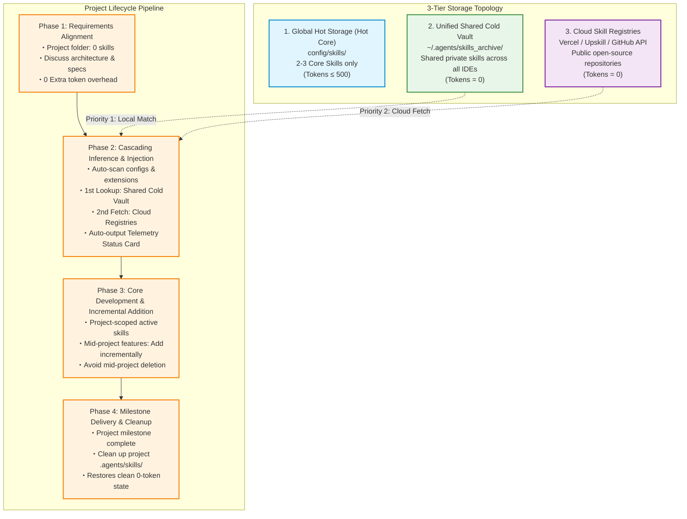
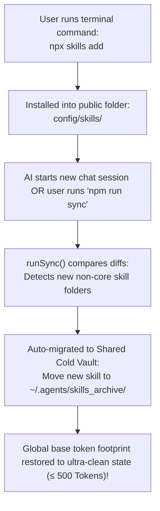

# Skill Orchestrator

> Multi-source dynamic inference, on-demand loading, and zero-base-token scheduling engine for AI Coding Agents.

[English](README.md) | [简体中文](README_CN.md)

---

## 🔥 Pain Points & Core Capabilities

In traditional setups, all AI Agent Skills are preloaded into the context window at the start of every chat session. This leads to massive token waste and fragmented private assets across different IDEs. `skill-orchestrator` solves this by introducing a **Unified Shared Cold Archive Vault** and **AST/Code-level Dynamic Inference**:

| Pain Point | Traditional Mode (All Preloaded) | Skill Orchestrator Architecture | Key Capability |
| :--- | :--- | :--- | :--- |
| **Base Token Overhead** | ~9,757 Tokens (wastes ~50% context) | **~0 - 500 Tokens** (95%+ reduction) | **Zero-Base Token Footprint**: Hot core base isolated from cold archive |
| **Private Asset Fragmentation** | Dispersed across IDE folders (.claude, .trae, .cursor) | **Unified Shared Cold Vault** (`~/.agents/skills_archive/`) | **Cross-IDE Asset Sharing**: 0ms instant sharing across Antigravity, Trae & Claude Code |
| **Skill Pollution & Scope** | Global pollution, chaotic auto-installs | **Priority-Based On-Demand Loading** (Project > Cold Vault > Cloud) | **Project Local Isolation**: All active project skills isolated under `./.agents/skills/` |
| **Inference Dimension** | Relies on LLM semantic guessing & human prompts | **5-Layer Code-Level Auto Inference** (package.json / extensions / intent) | **Zero-Prompt Code Matching**: Auto-scans config files & extensions like `.glsl`, `.swift` |
| **Cloud Registry Reach** | Relies solely on Vercel Registry | **Multi-Registry Cascade Resolution** (Vercel, Upskill, GitHub Orgs, CDN) | **Universal Multi-Registry Engine**: Full support for Vercel, Upskill, GitHub Orgs & CDN |
| **Latency & API Costs** | Re-calculates 10k token prompts every turn | **Prompt Cache Control Anchors** (4x Speedup, 90% Cost Reduction) | **Prompt Cache Injection**: Auto-injects `<!-- @cache-control: ephemeral -->` anchors |
| **Observability** | Zero visibility into token weight per skill | **Token Telemetry Diagnostic Dashboard** (Health Status Cards) | **Transparent Telemetry Report**: Check precise token usage anytime via `/status` |

---

## 🚀 Quick Start & Installation

### 1. Install via NPM Registry
```bash
npx skills add skill-orchestrator
```

### 2. Install via GitHub Repository
```bash
npx skills add amasun/skill-orchestrator
```

### CLI Commands (For Developers & Automation)
```bash
# 1. Multi-Source Dependency Auto-Inference (Scans configs, file extensions & package.json)
npx skill-orchestrator infer   # or skill-orchestrator infer

# 2. Auto-Sync scanner: Migrates manually installed npx skills to shared cold vault
npx skill-orchestrator sync    # or skill-orchestrator sync

# 3. Skill Merge & Deduplication Engine (Consolidates multi-IDE duplicates to 0 base tokens)
npx skill-orchestrator merge   # or skill-orchestrator merge

# 3. Token Budget Diagnostic Dashboard / Telemetry Report
npx skill-orchestrator status  # or skill-orchestrator status

# 4. Project Milestone Cleanup (Wipes project-level temporary skills)
npx skill-orchestrator cleanup # or skill-orchestrator cleanup

# 5. Smart Offboarding Eject (Restores skills to original IDE paths & uninstalls safely)
npx skill-orchestrator eject   # or skill-orchestrator eject

# 6. Targeted Single-IDE Skill Sync (Isolates specific IDE like gemini / claude / cursor)
npx skill-orchestrator sync --ide=gemini   # or --ide=claude, --ide=cursor
```

### ⚡ Shortcuts, Slash Commands & Triggers

In any AI Agent chat session, use slash commands or natural language triggers without touching the terminal:

| Slash Command (Recommended - Tab Autocomplete) | Alternate Syntax | Natural Language Prompt | Executed Action |
| :---: | :---: | :--- | :--- |
| **`/status`** | `$status` / `status` | **"Check Token status", "Skill Telemetry"** | `npx skill-orchestrator status` |
| **`/init`** | `$init` / `init` | **"Initialize Skill Vault", "Consolidate skills"** | `npx skill-orchestrator init` |
| **`/infer`** | `$infer` / `infer` | **"Check dependencies", "Auto-match skills"** | `npx skill-orchestrator infer` |
| **`/sync`** | `$sync` / `sync` | **"Sync manual npx skills", "Update vault"** | `npx skill-orchestrator sync` |
| **`/merge`** | `$merge` / `merge` | **"Merge duplicate skills", "Deduplicate skills"** | `npx skill-orchestrator merge` |
| **`/sync --ide=gemini`** | `sync gemini` | **"Only sync Gemini skills"** | `npx skill-orchestrator sync --ide=gemini` |
| **`/sync --ide=claude`** | `sync claude` | **"Only sync Claude skills"** | `npx skill-orchestrator sync --ide=claude` |
| **`/sync --ide=cursor`** | `sync cursor` | **"Only sync Cursor skills"** | `npx skill-orchestrator sync --ide=cursor` |
| **`/cleanup`** | `$cleanup` / `cleanup` | **"Project complete", "Clean up project skills"** | `npx skill-orchestrator cleanup` |
| **`/eject`** | `$eject` / `eject` / `uninstall` | **"Restore skills & eject", "Uninstall orchestrator"** | `npx skill-orchestrator eject` |

---

## 🛠️ Node.js Environment Self-Healing & Silent Installation

If Node.js is missing on the user's system, the AI Agent automatically detects the missing runtime and silently installs Node.js via the operating system's native package manager without prompting for manual browser downloads:

```bash
# Windows (Uses native winget silently with zero popups)
winget install OpenJS.NodeJS.LTS --silent --accept-source-agreements --accept-package-agreements

# macOS (Uses Homebrew)
brew install node

# Linux (Debian/Ubuntu)
sudo apt-get update -y && sudo apt-get install -y nodejs npm
```

---

## 📂 Directory Paths & Priority Resolution Matrix

The matrix below illustrates the location, role, and loading priority of skill assets:

| Directory Path | Role & Location | Priority & Resolution | Token Impact | Lifecycle & Cleanup |
| :--- | :--- | :---: | :---: | :--- |
| **`<ProjectRoot>/.agents/skills/`** | **Project-Scoped Active Skills** (Project Scope) | **Priority 1** (Reuses skills already loaded in project) | Active project scope only (~300-500 Tokens) | Cleaned up via `/cleanup` upon project completion |
| **`~/.agents/skills_archive/`** | **Unified Shared Cold Archive Vault** (Cold Vault) | **Priority 2** (0ms copy to project; shared across IDEs) | **0 Tokens** (Cold state, zero base overhead) | Permanent private vault; never wiped by project cleanup |
| **`~/.<ide-or-agent>/skills/`** | **IDE Hot Base Directory** (Hot Core Base) | **Priority 3** (Houses only 2-3 core essential skills) | Minimal overhead (&le; 500 Tokens) | Permanent hot loading |
| **`~/.gemini/config/skills/`**<br>**`~/.claude/skills/`**<br>**`~/.trae-cn/skills/`** | **IDE Public Skill Folders** (Public Folders) | **Auto-Sync Scanner** (Detects manual `npx` skill installs) | Restored to hot core on `runSync` | Auto-migrated to `~/.agents/skills_archive/` |

---

## 🔍 5-Layer Multi-Dimensional Inference Pipeline

The system uses a 5-layer code and intent detection pipeline to infer and inject required skills with zero extra communication:

```text
Project Source / Config / Conversation
 ├── 1. Package Config Files (package.json / requirements.txt / Cargo.toml / go.mod)
 ├── 2. Code Extension & AST Feature Scan (.glsl / .swift / .sqlx / .figma.ts)
 ├── 3. Conversation Semantic Intent ("Build frosted glass UI", "Audit SQL injection")
 ├── 4. Explicit Slash Command Triggers (/solidity, /gsap-core)
 └── 5. Cascading Circuit-Breaker Resolution (Project Local -> Cold Vault -> Multi-Cloud)
```

| Inference Layer | Trigger Source | Example Match |
| :--- | :--- | :--- |
| **1. Config Dependencies** | `package.json`, `requirements.txt`, `Cargo.toml` | Sees `"three"` ➔ Loads `3d-web-experience`; Sees `"torch"` ➔ Loads `ml-best-practices` |
| **2. Code Extensions** | `.glsl`, `.vert`, `.frag`, `.swift`, `.sqlx` | Sees `.glsl` ➔ Loads `web-shader-extractor`; Sees `.swift` ➔ Loads `figma-swiftui` |
| **3. Conversational Intent** | Natural language user prompts | Prompt mentions "dark glassmorphism UI" ➔ Loads `ditther-dark-glass` |
| **4. Slash Commands** | Slash commands or explicit tags | Prompt contains `/solidity` ➔ Explicitly loads `solidity` smart contract skill |
| **5. Cascading Resolution** | Disk locks & Network Registries | Project Scope (0ms) ➔ Cold Vault (0ms) ➔ Cascade Multi-Cloud Registries |

---

## 🌐 Universal Multi-Registry Cascading Engine

Fully compatible with leading public, enterprise, and custom skill registries:

| Registry Source | Maintained By | Specialty Domain | Auto-Fetch Command |
| :--- | :--- | :--- | :--- |
| **1. Vercel (`vercel-labs`)** | Vercel & Community | Web Frontend, Next.js, UI/UX Guidelines | `npx skills add <name>` |
| **2. Upskill (`upskill.dev`)** | Security Teams | Vulnerability Defense, Security Audits, Compliance | `npx upskill add <name>` |
| **3. Tech Giants (`Stripe/Cloudflare`)**| Industry Leaders | Official APIs, Serverless Edge, Databases | `npx skills add owner/repo` |
| **4. Domestic CDN / Mirrors** | Gitee / jsDelivr | Low latency mirrors (Ping < 30ms) | `npx skills add vercel-labs/skills/<name>` |
| **5. Private GitHub Orgs** | Enterprise Teams | Internal Architecture, Proprietary Specs | `npx skills add your-org/repo` |

---

## 🏗️ 3-Tier Hybrid Architecture



---

## 🔄 Manual `npx` Skill Auto-Sync Engine



---

## 📊 Token Telemetry Diagnostic Report

Trigger the Telemetry Report manually anytime using slash commands or natural language:

```text
------------------------------------------------------------
[Project Skills & Token Telemetry]
------------------------------------------------------------
Global Base Overhead : ~420 Tokens [Status: Healthy 🟢]
Project-Scoped Skills: 
   ├── 3d-web-experience   : 450 Tokens (Origin: Cold Archive | Infer: package.json)
   ├── web-shader-extractor: 380 Tokens (Origin: Cold Archive | Infer: Code Feature [.glsl])
   ├── upskill/sec-header  : 460 Tokens (Origin: Upskill Registry | Infer: Security Audit)
   ├── stripe/agent-skills : 510 Tokens (Origin: GitHub Org | Infer: Dependency Match)
   └── svelte-kit          : 470 Tokens (Origin: Vercel Registry | Infer: User Intent)
------------------------------------------------------------
Total Project Token Overhead : 2,690 Tokens (Save 72.4% vs Preload All)
Prompt Cache Anchor          : Injected (4x Speedup)
============================================================
```

### Q7: If I run `/cleanup`, how do I recover my project's previously used skills?
**Answer**: Used skills are automatically recorded in your project's `package.json`. Running `npx skill-orchestrator infer` (or `/infer`) reads the manifest and restores all skills from the cold archive in 0ms!

### Q8: Will cloud-downloaded skills pollute my private Cold Archive Vault?
**Answer**: No. Skills pulled from cloud registries are marked as project-scoped dependencies. They reside in `./.agents/skills/` and are removed during `/cleanup`, ensuring your private cold archive remains 100% clean.

### Q9: What happens if I update a skill published on npm/cloud?
**Answer**: Running `npx skill-orchestrator sync` (or `/sync`) detects updated skills in your IDE directories and automatically replaces old versions in the Cold Archive Vault with the latest version.

### Q10: How do I completely uninstall and restore all archived skills? (Eject Engine)
**Answer**: Simply run `npx skill-orchestrator eject` (or `/eject`). The system reads `vault_registry.json` and restores 100% of archived skills back to their exact original IDE paths, ensuring 0 data loss.

---

## 📜 License

[MIT](LICENSE) &copy; amasun
