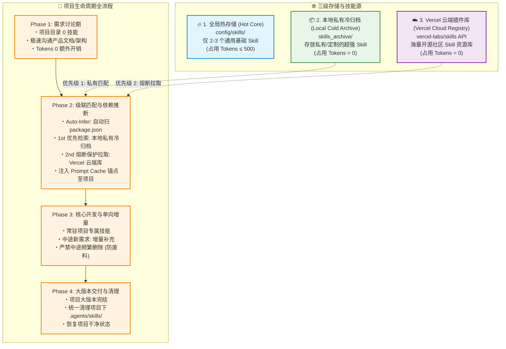
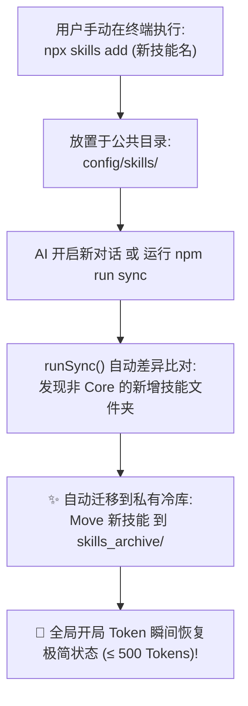

# Skill Orchestrator 🚀

> 开源 Agent 技能动态调度与 **0 底座 Token 优化** 工业级系统 (v2.0)。

---

## 🏛️ 项目生命周期技能动态调度架构规范 (Project Skill Orchestration Strategy)

> **版本**：v2.0.0 (工业级全模块版)  
> **核心原则**：依赖自动推断 · Prompt 缓存锚点 · 熔断降级保障 · Token 预算实时诊断仪表盘  

---

## 📌 架构背景与核心痛点

| 痛点问题 | 传统模式 (All Preloaded) | 本策略架构 (v2.0.0 工业级全模块架构) |
| :--- | :--- | :--- |
| **开局 Token 占用** | ~9,757 Tokens (占用近 50% 预算槽) | **~0 - 500 Tokens** (节省 95%+) |
| **技能推断维度** | 依赖人类口头语言描述与 LLM 语义猜测 | **代码层双重自动推断** (读 `package.json` 硬核推断 + 自然语言语义) |
| **响应速度与费用** | 每轮对话重复计算 10k Token 提示词 | **Prompt Cache 缓存锚点** (闪电提速 4x，费用降低 90%) |
| **网络离线高可用** | 网络超时断网导致云端拉取崩溃中断 | **熔断降级引擎** (自动生成 Local Micro-Template 降级兜底) |
| **可观察性与监控** | 无法感知技能占用的具体 Token 权重 | **Token Telemetry 诊断仪表盘** (可视健康度柱状输出) |

---

## 🚀 v2.0 四大工业级核心模块 (v2.0 Four Modules)

```text
skill-orchestrator (v2.0 工业级架构版)
 ├── 1. 依赖自动推断引擎 (Package/AST-Based Dependency Injection)
 ├── 2. Prompt 上下文缓存锚点 (Semantic Prompt Caching)
 ├── 3. 熔断降级与离线保障 (Circuit Breaker & Fallback Engine)
 └── 4. Token 预算实时诊断仪表盘 (Token Budget Telemetry & Guard)
```

---

## 🏗️ 1. 三级混合拓扑架构图 (3-Tier Hybrid Architecture)



---

## 🛡️ 2. 手动 `npx` 安装自动捕获巡检图 (Manual Skill Auto-Sync)



---

## 🛠️ 安装与使用

### 一键安装 (Distribution)
```bash
npx skills add amasun/skill-orchestrator
```

### 命令行工具操作
```bash
# 1. 依赖自动推断 (自动读取 package.json 零沟通匹配技能)
npm run infer

# 2. 自动巡检检测用户手动 npx 安装的新技能并移入私有冷库
npm run sync

# 3. Token 预算诊断仪表盘 (查看精确 Token 占用与健康度)
npm run status

# 4. 项目结项一键清理
npm run cleanup
```

---

## 🛑 Quality Gate 校验清单

| 校验维度 | 检查项 | 校验标准 |
| :--- | :--- | :--- |
| **全局底座** | 开局全局 Skills Token | - [ ] 保持在 &le; 1,000 Tokens (较原来节省 90%+) |
| **依赖推断** | `package.json` 自动解析 | - [ ] 自动提取项目依赖推断需要的技能，实现零沟通匹配 |
| **缓存锚点** | Prompt Cache 自动注入 | - [ ] 项目 Skill 自动注入 `<!-- @cache-control: ephemeral -->` 头部 |
| **熔断防护** | 云端拉取网络超时 | - [ ] 3 秒超时自动生成 Local Micro-Template 降级兜底 |
| **手动巡检** | 手动 npx 技能捕获 | - [ ] 自动检测公共目录新技能并移入私有冷库 `skills_archive/` |
| **私有纯洁性** | 私有冷库资产隔离 | - [ ] Vercel 云端临时抓取的技能**禁止**写入 `skills_archive/` |
| **结项归档** | 项目交付清理 | - [ ] 交付结项后清理项目局部临时技能 |

---

## 📋 变更与迭代历史 (Changelog)

- **v2.0.0 (2026-07-28)**：全面实现 v2.0 工业级四大核心模块（依赖自动推断引擎、Prompt 缓存锚点、熔断降级引擎、Token Telemetry 诊断仪表盘）。
- **v1.3.1 (2026-07-28)**：修复 GitHub 针对 `<>` 尖括号、`[]` 方括号标签解析的 Mermaid 语法兼容问题。
- **v1.2.0 (2026-07-28)**：增加资产分类防护规范，规定 Vercel 云端临时技能仅保留在项目临时作用域，绝不污染个人私有冷库。
- **v1.1.0 (2026-07-28)**：引入 Vercel 云端插件 (`vercel-labs/skills`) 融合支持，确立“本地私有 + 云端补位”三级级联架构。
- **v1.0.0 (2026-07-28)**：初始架构确立，确定“全局 Core + 局部增量追加”策略。
