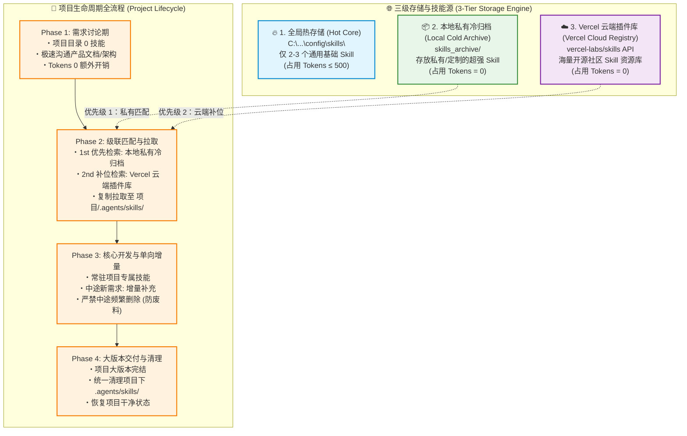

# Skill Orchestrator 🚀

> 开源 Agent 技能动态调度与 **0 底座 Token 优化** 系统。

---

## 🏛️ 项目生命周期技能动态调度架构规范 (Project Skill Orchestration Strategy)

> **版本**：v1.1.0 (云端混合强化版)  
> **核心原则**：全局 0 占用 · 本地私有+云端双级融合 · 单向增量追加 · 结项统一归档  

---

## 📌 架构背景与核心痛点

| 痛点问题 | 传统模式 (All Preloaded) | 本策略架构 (v1.1.0 混合云端架构) |
| :--- | :--- | :--- |
| **开局 Token 占用** | ~9,757 Tokens (占用近 50% 预算槽) | **~0 - 500 Tokens** (节省 95%+) |
| **作用域隔离** | 跨项目无差别全局加载 | **项目级隔离** (项目 A 不吃项目 B 的 Token) |
| **技能库边界** | 仅局限于本地硬编码安装的文件 | **无限扩展** (本地私有定制库 + Vercel 云端数千开源库) |
| **维护成本与损耗** | 手动/频繁增删易引发重复工具调用与上下文废料 | **三级级联检索 + 单向增量追加** |

---

## 🏗️ 三级混合拓扑架构设计 (3-Tier Hybrid Architecture)



---

## ⚙️ 级联检索与调度逻辑 (Cascade Retrieval Logic)

当项目需求定稿（Phase 2）或中途引入新需求（Phase 3）时，AI 遵循以下**三级级联检索顺序**：

1. **第一优先级（本地私有冷库 `skills_archive`）**：
   * 检查您本地经过深度优化、包含 Quality Gate 的私有技能（如 `John-seedance`、`ditther-dark-glass-design`）。如果匹配，直接从本地私有库拷贝至 `项目/.agents/skills/`。
2. **第二优先级（Vercel 云端插件库 `vercel-labs/skills`）**：
   * 如果本地私有库没有对应技能（如项目突然需要处理 `Solidity` 合约或 `SvelteKit` 框架），AI 自动调用 Vercel 云端插件 API 去开源社区搜索并拉取最新 Skill 补充至 `项目/.agents/skills/`。
3. **单向增量追加 (Incremental Addition)**：
   * 无论是从本地私有库还是 Vercel 云端拉取的技能，在当前项目开发期内一律**只增不删**，保障上下文连贯。

---

## 🛠️ 安装与使用

### 一键安装 (Distribution)
```bash
npx skills add <your-github-repo>/skill-orchestrator
```

### 命令行工具操作
```bash
# 初始化环境（创建归档库，瞬间释放 90%+ Token）
npm run init

# 查看当前技能状态（热存储 vs 冷归档）
npm run status

# 项目结项一键清理
npm run cleanup
```

---

## 🛑 Quality Gate 校验清单

| 校验维度 | 检查项 | 校验标准 |
| :--- | :--- | :--- |
| **全局底座** | 开局全局 Skills Token | - [ ] 保持在 ≤ 1,000 Tokens (较原来节省 90%+) |
| **级联检索** | 技能匹配来源优先级 | - [ ] 优先检索本地私有 Archive 库，未命中再检索 Vercel 云端 |
| **项目隔离** | 项目本地技能数量 | - [ ] 单个项目内 `.agents/skills/` 技能数控制在 2-4 个 |
| **增量连贯** | 动态增减损耗控制 | - [ ] 开发期禁止同一 Skill 反复删除与重新拷贝（只增不删） |
| **结项归档** | 项目交付清理 | - [ ] 交付结项后清理项目局部技能 |

---

## 📋 变更与迭代历史 (Changelog)

- **v1.1.0 (2026-07-28)**：引入 Vercel 云端插件 (`vercel-labs/skills`) 融合支持，确立“本地私有 + 云端补位”三级级联架构。
- **v1.0.0 (2026-07-28)**：初始架构确立，确定“全局 Core + 局部增量追加”策略。
