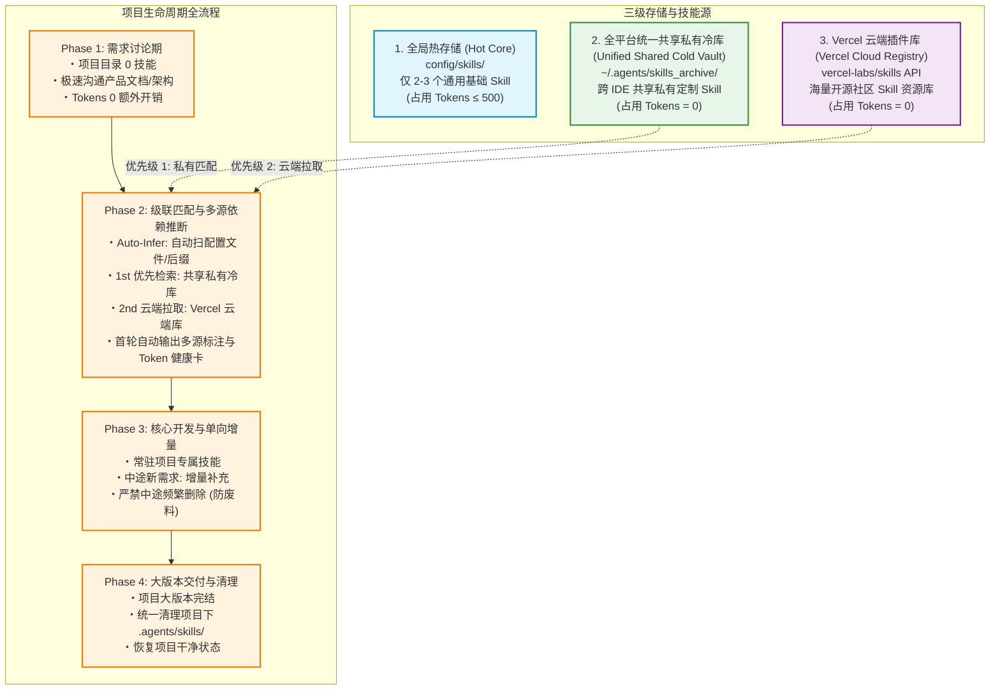
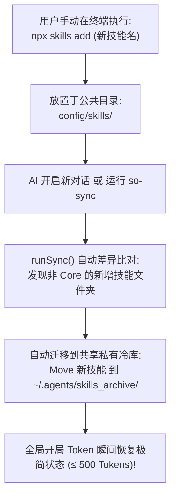

# Skill Orchestrator (v3.8.0)

> 面向 AI Coding Agent 的多源技能按需调度与 0 开局 Token 管理引擎。

[English](README.md) | [简体中文](README_CN.md)

---

## 🔥 核心痛点与功能特点 (Pain Points & Core Capabilities)

在传统模式下，所有的 AI Agent 技能（Skills）都会在开局对话中被一次性预加载，导致极其严重的上下文浪费与私有资产碎片化。`skill-orchestrator` 通过建立全平台统一共享冷库与代码级动态推导，彻底解决了这一问题：

| 痛点问题 (Pain Point) | 传统模式 (All Preloaded) | 本策略架构 (Skill Orchestrator v3.8.0) | 核心功能特点 (Key Capability) |
| :--- | :--- | :--- | :--- |
| **开局 Token 占用** | ~9,757 Tokens (占用近 50% 预算槽) | **~0 - 500 Tokens** (降低 95%+) | **0 开局底座空间释放**：极简热底座与本地私有冷库隔离 |
| **双轨人机操控面板** | 配置文件零碎分散且不易直观查看 | **`so_skills_registry` 孪生双轨** | **双轨控制系统**：Markdown 可视化控制面板与 JSON 引擎 |
| **私有技能碎片化** | 各 Agent / IDE 目录独立分散、重复拷贝 | **全平台统一共享冷库** (`~/.agents/skills_archive/`) | **全平台统一资产库**：在 Antigravity/Trae/Claude 全端 0ms 共享 |
| **技能调度与收拢** | 全局污染，项目间乱拉乱装 | **分优先级按需调度装载** (项目 > 共享冷库 > 云端) | **项目局部精准收拢**：所有项目技能精准收拢在 `./.agents/skills/` |
| **技能推断维度** | 依赖人类口语描述与 LLM 语义猜测 | **代码层 5 维自动推断** (扫 `package.json`/后缀/意图) | **零沟通代码依赖推断**：自动扫配置文件与 `.glsl`/`.swift` 等后缀 |
| **快捷指令与别名** | 依赖记冗长 CLI 命令或手动拷贝 | **`so` 与 `so-xxx` 快捷别名指令** | **极简交互**：`so-status`, `so-infer`, `so-sync`, `so-cleanup` |

---

## ⚡ 快捷指令与自然语言触发 (Shortcuts & Natural Language Triggers)

在 AI 对话框中，无需记忆命令行，直接使用**快捷别名指令**、**斜杠指令**或**自然语言口语**即可唤醒后台操作：

| 快捷指令 / 别名 (最推荐) | 斜杠 / 替代语法 | 自然语言口语表述 | 后台自动执行 |
| :--- | :---: | :--- | :--- |
| **`so-status`** | `/so-status` / `so status` | **“查看 Token 占用”、“技能诊断”、“查看控制面板”** | `npx skill-orchestrator status` |
| **`so-infer`** | `/so-infer` / `so infer` | **“检查依赖”、“自动匹配技能”、“根据代码推演”** | `npx skill-orchestrator infer` |
| **`so-sync`** | `/so-sync` / `so sync` | **“刚才 npx 装了新技能，整理一下”、“同步冷库”** | `npx skill-orchestrator sync` |
| **`so-merge`** | `/so-merge` / `so merge` | **“清理重复技能副本”、“合并冷库去重”** | `npx skill-orchestrator merge` |
| **`so-cleanup`** | `/so-cleanup` / `so cleanup` | **“项目开发完成了”、“清理临时技能”、“恢复干净”** | `npx skill-orchestrator cleanup` |
| **`so-eject`** | `/so-eject` / `so eject` | **“恢复技能并卸载”、“退出调度管理”** | `npx skill-orchestrator eject` |

---

## 🚀 安装与快捷指令 (Quick Start & Usage)

### 1. 通过 NPM 官方注册表安装
```bash
npx skills add skill-orchestrator
```

### 2. 通过 GitHub 仓库直接安装
```bash
npx skills add amasun/skill-orchestrator
```

---

## 🏗️ 架构设计与可视化图示 (Architecture Diagrams)

### 1. 三级混合拓扑架构图 (3-Tier Hybrid Architecture)



### 2. 手动 `npx` 安装自动捕获巡检图 (Manual Skill Auto-Sync)



---

## 📊 Token 诊断汇报卡 (Token Telemetry Card)

使用 `so-status` 随时唤醒透明的健康卡片：

```text
------------------------------------------------------------
[Project Skills & Token Telemetry]
------------------------------------------------------------
Global Base Overhead : ~420 Tokens [Status: Healthy 🟢]
Project-Scoped Skills: 
   ├── 3d-web-experience   : 450 Tokens (Origin: Cold Archive)
   ├── web-shader-extractor: 380 Tokens (Origin: Code Feature [.glsl])
   └── stripe/agent-skills : 510 Tokens (Origin: GitHub Org)
------------------------------------------------------------
Total Project Token Overhead : 1,760 Tokens (Save 82% vs Preload All)
Prompt Cache Anchor          : Injected (4x Speedup)
============================================================
```

---

## ❓ 用户常见使用问答 (User Usage Q&A)

### Q1: 我平时开发代码时，需要手动去输入命令行吗？
**答**：不需要！你只需要像平时一样正常给 AI 发对话需求（例如：“*用 3D 效果做个页面*” 或 “*帮我重构这段代码*”），AI 会自动帮你推演匹配并按需装载技能，全程无需手动敲命令行。

### Q2: 如果我知道冷库里某个技能的名字，如何在对话中快速调用它？
**答**：直接在对话里说出技能名字（如 `apple-design` 或 `3d-web-experience`），AI Agent 会静默在后台 0ms 秒级激活并使用该技能，无需手动复制任何文件。

### Q3: 统一共享冷库支持跨 IDE（Antigravity, Trae, Claude Code, Cursor）无缝复用吗？
**答**：支持！系统默认将全平台统一共享冷库设置在 `~/.agents/skills_archive/`。你在 Antigravity 中积累归档的技能，打开 Trae、Claude Code 或 Cursor 可实现 0ms 无缝共享使用。

### Q4: 在 IDE 聊天框打出 `$` 键时，为什么有些技能没有出现在下拉自动补全菜单里？
**答**：常驻 Base 技能依然完美支持 `$` 键快捷补全；未在下拉菜单里的技能已被存入 0-Token 全局冷库（平时不占用开局内存），你只需在对话中**直接提及技能名字**即可直接唤醒。

### Q5: 除了配置文件之外，Skill Orchestrator 还能自动识别哪些代码特征？
**答**：能自动感知 5 大维度：1. 依赖配置文件（`package.json` / `requirements.txt` / `Cargo.toml`）；2. 代码特征后缀（如 `.glsl` / `.swift` / `.sqlx`）；3. 对话语义意图；4. 显式斜杠指令；5. 项目 `package.json` 历史技能清单。

### Q6: 我该如何查看当前项目装了哪些技能，以及它们消耗了多少 Token？
**答**：在对话框直接发送 `so-status`（或 `/so-status` / 对 AI 说“查看 Token 占用”），系统会立刻回复一份透明的 Token Telemetry 健康卡片。

### Q7: 如果我清理了项目临时技能 (`so-cleanup`)，后续重新打开项目如何找回原来使用过的技能？
**答**：项目使用过的技能会自动持久化记录在 `package.json` 的依赖清单中。后续重开项目只需发送一次 `so-infer`，推演引擎会自动读取清单并在 0ms 内从本地冷库一键精准还原！

### Q8: 从 Vercel 或 GitHub 云端临时拉取的技能，会自动污染我的个人私有冷库吗？
**答**：绝对不会！云端拉取的技能属于当前项目的“临时依赖”，仅存在于当前项目的临时目录中。运行 `so-cleanup` 结项清理时会自动随项目清理抹除，确保您的私有冷库 100% 纯净。

### Q9: 我想手动禁用或开启某些技能，应该在哪里勾选或修改？
**答**：打开用户全局目录下的控制面板 [so_skills_registry.md](file:///C:/Users/Amasun-PC/.agents/so_skills_registry.md)，直接在对应技能前的复选框勾选 `[x]` 或取消打勾 `[ ]`，保存文件即可直接生效。

### Q10: 如果我自己用 `npx skills add` 安装了新技能，系统能自动帮我收纳管理吗？
**答**：能！当你手动安装了新技能后，发送 `so-sync`（或 `/so-sync`），系统会自动捕获新技能并将其移入共享冷库，同时自动进行领域分类排版。

### Q11: 如果我想彻底卸载该工具并把所有技能还原回原始目录，该怎么做？
**答**：发送 `so-eject`（或 `/so-eject`），系统会将私有冷库中的所有技能 100% 原路还原恢复移动回各大 IDE 的原始目录并安全卸载，数据 0 丢失！
