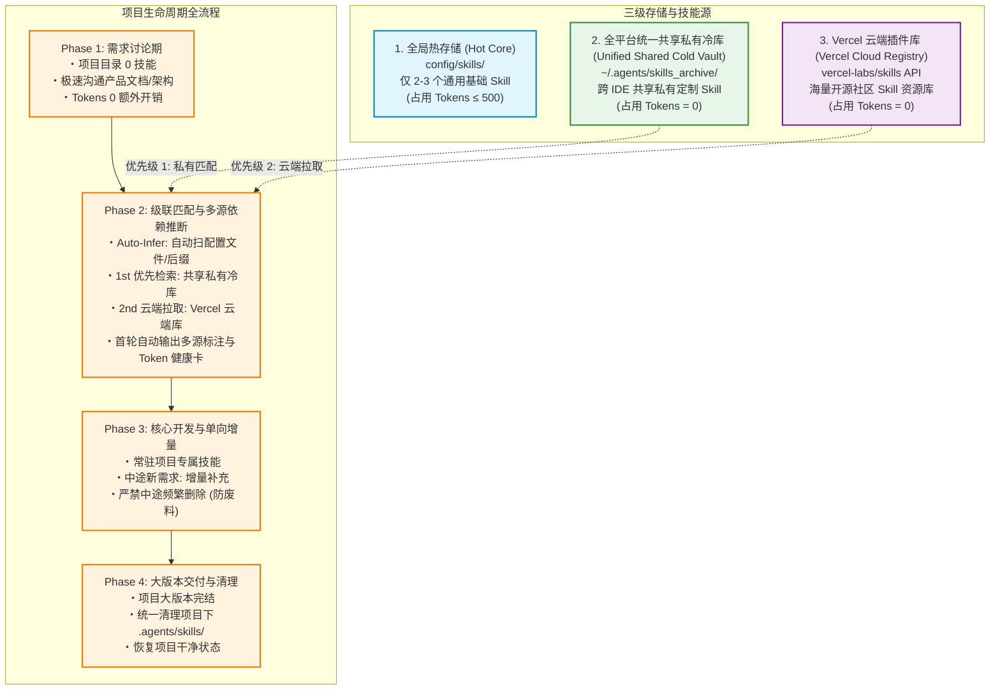
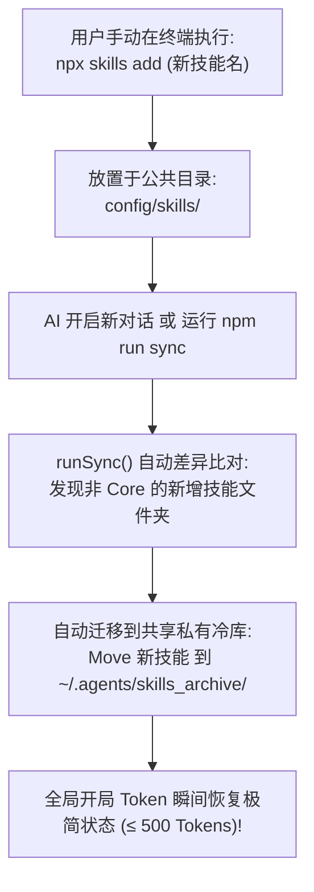

# Skill Orchestrator (v3.8.0)

> 面向 AI Coding Agent 的多源技能动态推断、按需装载与 0 开局 Token 调度引擎。

[English](README.md) | [简体中文](README_CN.md)

---

## 🔥 核心痛点与功能特点 (Pain Points & Core Capabilities)

在传统模式下，所有的 AI Agent 技能（Skills）都会在开局对话中被一次性预加载，导致极其严重的上下文浪费与私有资产碎片化。`skill-orchestrator` 通过建立全平台统一共享冷库与代码级动态推导，彻底解决了这一问题：

| 痛点问题 (Pain Point) | 传统模式 (All Preloaded) | 本策略架构 (Skill Orchestrator v3.8.0) | 核心功能特点 (Key Capability) |
| :--- | :--- | :--- | :--- |
| **开局 Token 占用** | ~9,757 Tokens (占用近 50% 预算槽) | **~0 - 500 Tokens** (降低 95%+) | **0 开局底座空间释放**：极简热底座与本地私有冷库隔离 |
| **双轨人机操控面板** | 配置文件零碎分散且不易直观查看 | **`so_skills_registry` 孪生双轨** | **双轨对称系统**：Markdown 可视化控制面板与 JSON 引擎 |
| **私有技能碎片化** | 各 Agent / IDE 目录独立分散、重复拷贝 | **全平台统一共享冷库** (`~/.agents/skills_archive/`) | **全平台统一资产库**：在 Antigravity/Trae/Claude 全端 0ms 共享 |
| **技能调度与收拢** | 全局污染，项目间乱拉乱装 | **分优先级按需调度装载** (项目 > 共享冷库 > 云端) | **项目局部精准收拢**：所有项目技能精准收拢在 `./.agents/skills/` |
| **快捷指令与别名** | 依赖记冗长 CLI 命令或手动拷贝 | **`so` 与 `so-xxx` 快捷别名指令** | **极简交互**：`so-status`, `so-infer`, `so-sync`, `so-cleanup` |

---

## 🚀 安装与使用 (Quick Start & Installation)

### 1. 通过 NPM 官方注册表安装
```bash
npx skills add skill-orchestrator
```

### 2. 通过 GitHub 仓库直接安装
```bash
npx skills add amasun/skill-orchestrator
```

### 快捷指令与快捷别名 (`so` & `so-xxx`)
```bash
# 1. 查阅 Token 诊断与双轨注册表状态卡片
so-status  # 或 npx skill-orchestrator status

# 2. 多源依赖自动推断 (零沟通匹配代码与技能)
so-infer   # 或 npx skill-orchestrator infer

# 3. 自动同步冷库、生成领域分类 Markdown 面板与 JSON 数据库
so-sync    # 或 npx skill-orchestrator sync

# 4. 技能合并与去重引擎 (清理重复技能，归降开局 Token)
so-merge   # 或 npx skill-orchestrator merge

# 5. 项目结项一键清理 (退回 0-Token 共享冷库)
so-cleanup # 或 npx skill-orchestrator cleanup

# 6. 退出机制 (彻底还原所有技能并卸载，数据 0 丢失)
so-eject   # 或 npx skill-orchestrator eject
```

### ⚙️ 用户自定义底层基础技能配置 (`~/.agents/base_skills.json`)

系统会在 `~/.agents/base_skills.json` 自动生成基础技能白名单配置文件，并通过 AI 语义分析引擎（Semantic Skill Analyzer）自动对 `SKILL.md` 进行检测。如果是通用元技能（Workflow/Refactoring/Debug 等），会自动添加并保留在基础底座中，**100% 保证它们绝对不会被意外移入冷库**：

```json
{
  "version": "1.1.0",
  "core_base_skills": [
    "z-coding-refactoring",
    "agentic-workflow",
    "find-skills",
    "skill-orchestrator"
  ]
}
```

---

### 斜杠指令与自然语言触发 (Triggers & Shortcuts)

在 AI 对话框中，无需输入命令行，直接使用**斜杠指令**或**自然语言**即可自动触发后台操作：

| 斜杠指令 (最推荐 - 支持 IDE 敲 / 自动补全) | 替代语法 | 自然语言口语表述 | 后台自动执行 |
| :---: | :---: | :--- | :--- |
| **`/status`** | `$status` / `status` | **“查看 Token 占用”、“技能诊断”** | `npx skill-orchestrator status` |
| **`/init`** | `$init` / `init` | **“初始化技能库”、“清空开局占用”** | `npx skill-orchestrator init` |
| **`/infer`** | `$infer` / `infer` | **“检查依赖”、“自动匹配技能”** | `npx skill-orchestrator infer` |
| **`/sync`** | `$sync` / `sync` | **“刚才 npx 装了新技能，整理一下”** | `npx skill-orchestrator sync` |
| **`/merge`** | `$merge` / `merge` | **“合并重复技能”、“技能去重”、“压缩开局占用”** | `npx skill-orchestrator merge` |
| **`/sync --ide=gemini`** | `sync gemini` | **“只归档/整理 Gemini 的技能”** | `npx skill-orchestrator sync --ide=gemini` |
| **`/sync --ide=claude`** | `sync claude` | **“把 Claude 的技能移入冷库”** | `npx skill-orchestrator sync --ide=claude` |
| **`/sync --ide=cursor`** | `sync cursor` | **“只整理 Cursor 的技能”** | `npx skill-orchestrator sync --ide=cursor` |
| **`/cleanup`** | `$cleanup` / `cleanup` | **“项目开发完成了”、“清理临时技能”** | `npx skill-orchestrator cleanup` |
| **`/eject`** | `$eject` / `eject` / `uninstall` | **“恢复技能并卸载”、“退出调度管理”** | `npx skill-orchestrator eject` |

---

## 🛠️ Node.js 环境自愈与静默安装 (Node.js Environment Self-Healing)

如果用户的电脑尚未安装 Node.js 环境，AI Agent 在执行任何调度指令前会自动检测并**利用操作系统内置包管理器后台静默安装 Node.js**，无需用户手动去官网下载配置：

```bash
# Windows (利用系统内置 winget 静默后台安装，0 弹窗)
winget install OpenJS.NodeJS.LTS --silent --accept-source-agreements --accept-package-agreements

# macOS (利用 Homebrew 自动静默安装)
brew install node

# Linux (Debian/Ubuntu 静默安装)
sudo apt-get update -y && sudo apt-get install -y nodejs npm
```

---

## 📂 技能存储路径与加载优先级对照表 (Directory Paths & Priorities)

使用本插件后，技能资产在磁盘上的分布定位与优先级匹配关系如下：

| 目录路径 (Directory Path) | 目录角色与定位 | 加载与匹配优先级 | Token 空间影响 | 生命周期与清理 |
| :--- | :--- | :---: | :---: | :--- |
| **`<项目根目录>/.agents/skills/`** | **本项目专属动态技能目录** (Project Scope) | **第 1 优先级** (优先复用当前项目内已装载技能) | 仅在当前项目占用 (~300-500 Tokens) | 项目结项使用 `/cleanup` 一键清理 |
| **`~/.agents/skills_archive/`** | **全平台统一共享私有冷库** (Unified Shared Cold Vault) | **第 2 优先级** (命中即 0ms 复制入项目，跨 IDE 全端共享) | **0 Tokens** (完全冷冻，开局 0 占用) | 永久私有保存，绝对不随项目清理 |
| **`~/.<ide-or-agent>/skills/`** | **当前 IDE / Agent 全局热底座目录** (Hot Core Base) | **第 3 优先级** (仅常驻 2-3 个通用核心 Core Skill) | 保持极低开销 (&le; 500 Tokens) | 常驻热加载 |
| **`~/.gemini/config/skills/`**<br>**`~/.claude/skills/`**<br>**`~/.trae-cn/skills/`** | **各大 IDE 公共技能目录** (Public Skill Folders) | **自动巡检捕获** (检测用户手动 `npx` 安装的新技能) | 触发 `runSync` 后恢复极简 | 自动巡检移入统一共享冷库 `~/.agents/skills_archive/` |

---

## 🔍 5 维多源自动推断逻辑 (5-Layer Multi-Dimensional Inference Pipeline)

系统通过代码层与语义层的 5 维智能推断管道，零沟通精准判别并装载项目所需的技能：

```text
项目源码 / 配置 / 对话
 ├── 1. 包配置文件扫描 (package.json / requirements.txt / Cargo.toml / go.mod)
 ├── 2. 代码特征与后缀扫描 (.glsl / .swift / .sqlx / .figma.ts)
 ├── 3. 用户对话意图与语义匹配 ("做个磨砂玻璃 UI" / "检查 API 安全头")
 ├── 4. 显式斜杠快捷唤醒 (/solidity, /gsap-core)
 └── 5. 三级级联查找与去重锁 (项目局部 -> 共享冷库 -> 多云端源)
```

| 推断维度 | 触发探测源 | 典型匹配示例 |
| :--- | :--- | :--- |
| **1. 依赖配置文件** | `package.json`, `requirements.txt`, `Cargo.toml` | 扫到 `"three"` ➔ `3d-web-experience`；扫到 `"torch"` ➔ `ml-best-practices` |
| **2. 代码后缀特征** | `.glsl`, `.vert`, `.frag`, `.swift`, `.sqlx` | 发现 `.glsl` ➔ `web-shader-extractor`；发现 `.swift` ➔ `figma-swiftui` |
| **3. 对话语义意图** | 自然语言需求描述 | 提到“毛玻璃暗黑 UI” ➔ `ditther-dark-glass`；提到“SQL 注入审计” ➔ `upskill/sec-header` |
| **4. 显式斜杠唤醒** | 斜杠指令或唤醒词 | 输入 `/solidity` ➔ 显式精确装载 `solidity` 智能合约技能 |
| **5. 级联去重查找** | 磁盘目录锁 & 网络 API | 命中项目目录 (0ms) ➔ 命中共享冷库 (0ms) ➔ 级联多云端源 |

---

## 全网多云端源与本地注册表级联支持表 (Multi-Registry Universal Engine)

系统全面适配并内置实现了全网多云端与本地注册表源的按需匹配与精准拉取：

| 云端/本地来源 | 维护主体 | 核心差异化领域 | 自动化匹配/拉取逻辑 |
| :--- | :--- | :--- | :--- |
| **1. Vercel (`vercel-labs`)** | Vercel & 开源社区 | Web 前端、Next.js、UI/UX 规范 | `npx skills add <name>` |
| **2. Upskill (`upskill.dev`)** | 安全团队 | 恶意代码防御、安全审计、合规重构 | `npx upskill add <name>` |
| **3. 巨头官方 (`Stripe/Cloudflare`)**| 各大 Tech 巨头 | 官方 API、Serverless 边缘计算、数据库 | `npx skills add owner/repo` |
| **4. 国内 Gitee / CDN 节点** | Gitee / jsDelivr | 国内秒级响应 (Ping < 30ms) | `npx skills add vercel-labs/skills/<name>` |
| **5. 您的私有 GitHub 组织** | 您的团队 | 团队内部私有架构、商业护城河规范 | `npx skills add your-org/repo` |

---

## 四大工业级核心模块 (Four Core Modules)

```text
skill-orchestrator
 ├── 1. 依赖自动推断引擎 (Package/AST-Based Dependency Injection)
 ├── 2. Prompt 上下文缓存锚点 (Semantic Prompt Caching)
 ├── 3. 极速容错降级保障 (Fallback Engine)
 └── 4. Token 预算实时诊断仪表盘 (Token Budget Telemetry & Guard)
```

---

## 1. 三级混合拓扑架构图 (3-Tier Hybrid Architecture)



---

## 2. 手动 `npx` 安装自动捕获巡检图 (Manual Skill Auto-Sync)



---

## 汇报卡触发与手动唤醒规范 (Telemetry Report Protocol)

### 唤醒/触发的四种方式：
1. **首轮自动触发**：新项目需求定稿 / 中途新增大模块技能时，AI 在回复末尾自动呈现。
2. **斜杠指令唤醒（最推荐）**：在对话框输入 `/status`（利用 IDE 的 Tab 键自动补全）。
3. **自然语言唤醒**：对 AI 说“查看 Token 占用”、“技能诊断”、“当前项目装了哪些技能”。
4. **命令行唤醒（开发者）**：在项目终端运行 `npm run status`（等价于执行 `node scripts/orchestrate.js status`）。

```text
------------------------------------------------------------
[Project Skills & Token Telemetry]
------------------------------------------------------------
Global Base Overhead : ~420 Tokens [Status: Healthy 🟢]
Project-Scoped Skills: 
   ├── 3d-web-experience   : 450 Tokens (Origin: Cold Archive | Infer: package.json)
   ├── web-shader-extractor: 380 Tokens (Origin: Cold Archive | Infer: Code Feature [.glsl])
   ├── upskill/sec-header  : 460 Tokens (Origin: Upskill Registry | Infer: Security Audit)
   ├── stripe/agent-skills : 510 Tokens (Origin: GitHub Org | Infer: Dependency Match)
   └── svelte-kit          : 470 Tokens (Origin: Vercel Registry | Infer: User Intent)
------------------------------------------------------------
Total Project Token Overhead : 2,690 Tokens (Save 72.4% vs Preload All)
Prompt Cache Anchor          : Injected (4x Speedup)
============================================================
```

---

## ❓ 用户常见使用问答 (User Usage Q&A)

### Q1: 我平时开发代码时，需要手动去输入命令行吗？
**答**：不需要！你只需要像平时一样正常给 AI 发对话需求（例如：“*用 3D 效果做个页面*” 或 “*帮我重构这段代码*”），AI 会自动帮你推演匹配并按需装载技能，全程无需手动敲命令行。

### Q2: 如果我知道冷库里某个技能的名字，如何在对话中快速调用它？
**答**：直接在对话里说出技能名字（如 `apple-design` 或 `3d-web-experience`），AI Agent 会静默在后台 0ms 秒级激活并使用该技能，无需手动复制任何文件。

### Q3: 在 IDE 聊天框打出 `$` 键时，为什么有些技能没有出现在下拉自动补全菜单里？
**答**：常驻 Base 技能依然完美支持 `$` 键快捷补全；未在下拉菜单里的技能已被存入 0-Token 全局冷库（平时不占用开局内存），你只需在对话中**直接提及技能名字**即可直接唤醒。

### Q4: 我该如何查看当前项目装了哪些技能，以及它们消耗了多少 Token？
**答**：在对话框直接发送 `so-status`（或 `/so-status` / 对 AI 说“查看 Token 占用”），系统会立刻回复一份透明的 Token Telemetry 健康卡片。

### Q5: 项目开发完结后，如何一键清理项目里的临时技能文件，恢复干净状态？
**答**：在对话框发送 `so-cleanup`（或 `/so-cleanup`），系统会一键清理项目下的临时技能并归还至全局共享冷库，恢复项目干净状态。

### Q6: 我想手动禁用或开启某些技能，应该在哪里勾选或修改？
**答**：打开用户全局目录下的控制面板 [so_skills_registry.md](file:///C:/Users/Amasun-PC/.agents/so_skills_registry.md)，直接在对应技能前的复选框勾选 `[x]` 或取消打勾 `[ ]`，保存文件即可直接生效。

### Q7: 如果我自己用 `npx skills add` 安装了新技能，系统能自动帮我收纳管理吗？
**答**：能！当你手动安装了新技能后，发送 `so-sync`（或 `/so-sync`），系统会自动捕获新技能并将其移入共享冷库，同时自动进行领域分类排版。

### Q8: 如果我想彻底卸载该工具并把所有技能还原回原始目录，该怎么做？
**答**：发送 `so-eject`（或 `/so-eject`），系统会将私有冷库中的所有技能 100% 原路还原恢复移动回各大 IDE 的原始目录并安全卸载，数据 0 丢失！
